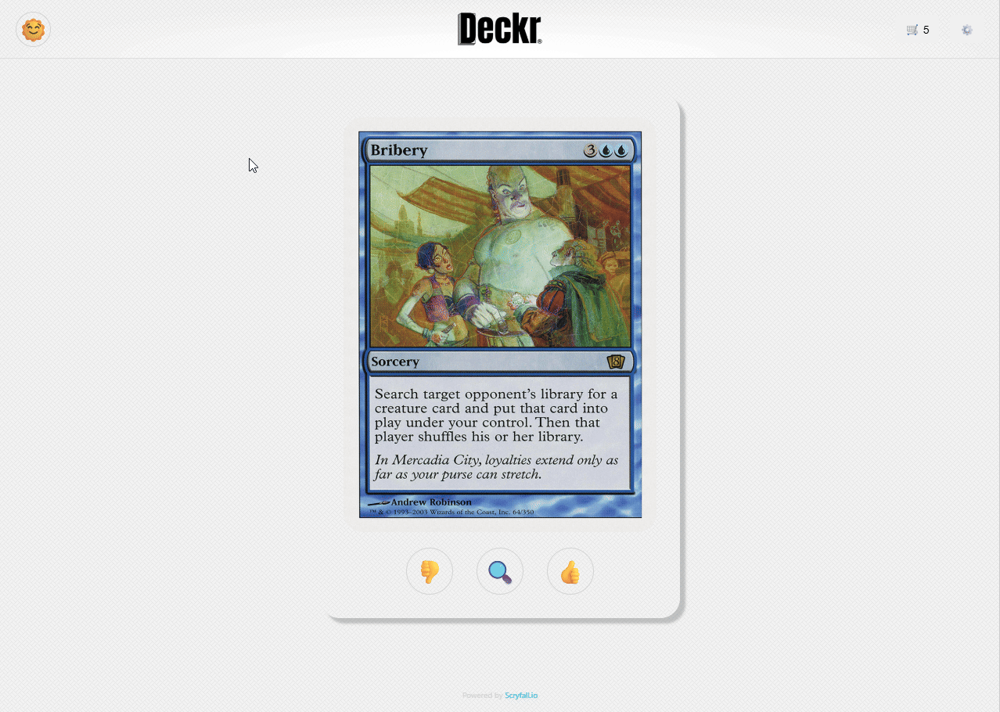

# Deckr-Public
💘 Deckr — MTG Card Collector — Swipe Your Way to the Ultimate Deck
Tired of clunky spreadsheets and dull card lists? Meet your new cardboard crush. MTG Card Collector lets you manage your Magic: The Gathering collection like you're on a dating app — fast, fun, and full of potential.
https://deckr.onrender.com/

🔮 Features
👈👉 Swipe Left or Right — Add cards to your collection (or pass) with a simple gesture, just like your favorite dating app.

📂 View Your Saved Cards — See all your matches in one place — no ghosting here.

🌙 Light & Dark Mode — Whether you’re building your deck at dawn or drafting at dusk, we’ve got the perfect vibe.

🔍 Powerful Search — Quickly find the card you’re looking for by name, type, or keyword. No more digging.

🧱 Architecture Diagram
Here’s a high-level overview of how the app is structured:

